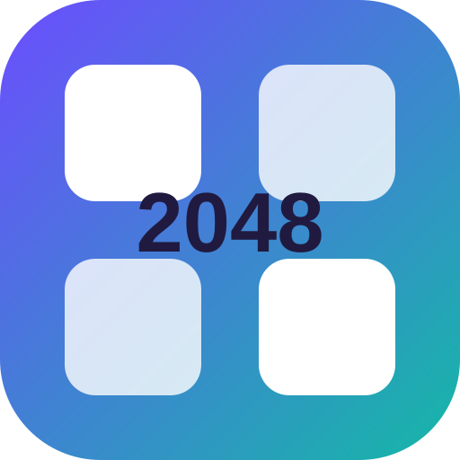

<div align="center">
  

# 2048 Nova

**A modern, accessible, offline-first 2048 puzzle game built with Flutter.**

Made by the Sanskar

[Source](https://github.com/sanskarIN/2048) · [Documentation](docs/README.md) · [Verification](docs/VERIFICATION.md) · [Roadmap](ROADMAP.md) · [Support](SUPPORT.md) · [Gumroad](https://ramsandesh.gumroad.com) · [Buy Me a Coffee](https://buymeacoffee.com/sanskarIN)

<a href="https://ramsandesh.gumroad.com">
  
</a>
</div>

## Overview

2048 Nova preserves the familiar 2048 rules while adding a modern cross-platform interface, deterministic game engine, multiple board sizes and challenge modes, save/resume, robust Undo, offline shareable seeded Challenge Codes with local QR rendering, portable current-game backup/restore, read-only Move Replay, heuristic hints, an isolated Auto Play demonstration with heuristic and bounded expectimax strategies, deterministic solver benchmarks, statistics, achievements, theme palettes, accessibility controls, Daily Challenge, and open-source project tooling.

The normal game is offline-first. It does not require an account, subscription, analytics service, advertising tracker, cloud-sync backend, remote AI model, or permanent internet connection. Internet access is only needed when a player deliberately opens an external destination such as GitHub, LinkedIn, email, Gumroad, or Buy Me a Coffee.

The repository is currently on the **`1.5.0+15` Version 1.5 line**. Automated quality and native build evidence remains required, while physical-device, real screen-reader, signing/provisioning, long-session, and store-release qualification stay explicit manual boundaries before a qualified stable-release claim.

Release promotion remains fail-closed: `dart run tool/release_readiness.dart` validates Version 1.5 candidate metadata and the evidence manifest, while `dart run tool/release_readiness.dart --stable` refuses promotion until the package is the `1.5.0` stable target, the changelog has a matching stable release section, and every required real-world qualification item has recorded passed evidence. See [`docs/RELEASE_QUALIFICATION.md`](docs/RELEASE_QUALIFICATION.md).

Hosted native release builds are now packaged as short-lived checksummed qualification artifacts for Android, Linux, Windows, macOS, and unsigned iOS. They provide reproducible inputs for real-target testing but do not replace the 13 manual evidence records. See [`docs/RELEASE_ARTIFACTS.md`](docs/RELEASE_ARTIFACTS.md).

## Features

- Deterministic, UI-independent 2048 engine with correct one-merge-per-source-tile behavior.
- Classic 4×4, Quick 3×3, Extended 5×5, Challenge 6×6, Endless, Target, Time Challenge, Move Limit, Daily Challenge, and Zen modes.
- Selectable Target milestones from 128 through 16384.
- Offline **Challenge Codes** that share a supported deterministic game configuration/seed as checksummed `NOVA1...` text plus a local black-on-white QR containing the exact same text, without accounts, camera permission, or cloud synchronization.
- Challenge Code validation for size, prefix, checksum, Base64URL/JSON envelope, format/version, strict `GameConfig`, deterministic seed, and supported-mode allowlist; Daily mode is intentionally excluded.
- Touch/swipe, Arrow Keys, and W/A/S/D movement plus H for Hint, U for Undo, P/Escape for Pause, and R for Restart on keyboard platforms.
- Save/resume with schema-versioned local state, structural validation, startup challenge reconciliation, and corruption-safe self-healing.
- Persistent Undo history with deterministic RNG restoration, stale-session filtering, lifetime-best-score preservation, and a 50-snapshot bound.
- **Game Backup** for copying/restoring one current game as validated JSON through the clipboard or explicit user-selected `.nova2048` / `.json` files, with byte-bounded file reads before UTF-8/JSON validation.
- Portable imported games are always **unranked**, remain unranked after restart, clear unrelated Undo history, and cannot mutate lifetime statistics, achievements, streaks, or Daily results.
- Read-only **Move Replay** built from the current game and validated retained Undo snapshots, with scrub, first/previous/next/latest navigation, play/pause, 1/2/4-frame-per-second playback, defensive copies, and explicit disclosure when bounded history begins after move zero.
- Deterministic non-automatic heuristic hints that evaluate empty cells, merges, corner strategy, monotonicity, and board smoothness without consuming game RNG.
- Optional **Auto Play Demo** with pause/resume, single-step control, speed selection, deterministic seed reset, Heuristic/Expectimax strategy selection, visible expectimax search-node diagnostics, and demo-only metrics. Both strategies run in the isolated sandbox and never write player saves, lifetime statistics, achievements, or Daily history.
- Statistics including games, wins, win rate, best score, highest tile, total moves/merges, averages, and streaks.
- Local achievements with progress and unlock dates.
- Date-seeded offline Daily Challenge with deduplicated local history, sticky completion/win state, and best-result preservation across replays.
- Light, dark, and system brightness with Classic Nova, Midnight, Neon, Ocean, Forest, Sunset, and Monochrome palettes.
- High-contrast mode, reduced motion, positional semantic tile labels, keyboard access, visible numeric values, and system text scaling support.
- Confirmation before replacing a recoverable saved game and explicit terminal-game choices.
- Optional lightweight system sound and haptic feedback where supported.
- Responsive board layouts for multiple window and screen sizes.
- Branded splash screen, application icons, and tasteful **Made by the Sanskar** identity.
- Prominent **Ramsandesh Gumroad** storefront entry points plus optional Buy Me a Coffee support and a direct GitHub bug-report action.
- GitHub Actions quality checks, cross-platform release-build verification, Dependabot, issue templates, and contribution/security documentation.

## Documentation

The complete documentation map is [`docs/README.md`](docs/README.md). Important references include:

| Topic | Document |
| --- | --- |
| Architecture | [`docs/ARCHITECTURE.md`](docs/ARCHITECTURE.md) |
| Engine rules | [`docs/GAME_ENGINE.md`](docs/GAME_ENGINE.md) |
| All game modes | [`docs/GAME_MODES.md`](docs/GAME_MODES.md) |
| Challenge Codes | [`docs/CHALLENGE_CODES.md`](docs/CHALLENGE_CODES.md) |
| Hint + Auto Play | [`docs/HINT_SOLVER.md`](docs/HINT_SOLVER.md) |
| Solver strategies + benchmarks | [`docs/SOLVER_BENCHMARKS.md`](docs/SOLVER_BENCHMARKS.md) |
| Local storage/data | [`docs/DATA_STORAGE.md`](docs/DATA_STORAGE.md) |
| Backup and restore | [`docs/BACKUP_AND_RESTORE.md`](docs/BACKUP_AND_RESTORE.md) |
| File backup transport | [`docs/FILE_BACKUPS.md`](docs/FILE_BACKUPS.md) |
| Accessibility | [`docs/ACCESSIBILITY.md`](docs/ACCESSIBILITY.md) |
| Privacy | [`docs/PRIVACY.md`](docs/PRIVACY.md) |
| Development | [`docs/DEVELOPMENT.md`](docs/DEVELOPMENT.md) |
| CI/CD | [`docs/CI_CD.md`](docs/CI_CD.md) |
| Testing | [`docs/TESTING.md`](docs/TESTING.md) |
| Verification | [`docs/VERIFICATION.md`](docs/VERIFICATION.md) |
| Troubleshooting | [`docs/TROUBLESHOOTING.md`](docs/TROUBLESHOOTING.md) |
| Release qualification gate | [`docs/RELEASE_QUALIFICATION.md`](docs/RELEASE_QUALIFICATION.md) |
| Native qualification artifacts | [`docs/RELEASE_ARTIFACTS.md`](docs/RELEASE_ARTIFACTS.md) |
| Release gate regression testing | [`docs/RELEASE_GATE_TESTING.md`](docs/RELEASE_GATE_TESTING.md) |
| Release checklist | [`docs/RELEASE_CHECKLIST.md`](docs/RELEASE_CHECKLIST.md) |
| Branding | [`docs/BRANDING.md`](docs/BRANDING.md) |
| Dependencies | [`docs/DEPENDENCIES.md`](docs/DEPENDENCIES.md) |
| Chronological implementation log | [`what_changed.md`](what_changed.md) |

## Configured targets

The repository contains Flutter runners for:

- Android
- iOS
- Web / PWA
- Windows
- macOS
- Linux

A target is only described as verified after its corresponding CI/build check has completed successfully. See [`docs/VERIFICATION.md`](docs/VERIFICATION.md) for compact current evidence and [`what_changed.md`](what_changed.md) for the chronological verification record including intermediate failures and fixes.

## Controls

| Input | Action |
| --- | --- |
| Swipe | Move in swipe direction |
| Arrow Keys | Move tiles |
| W / A / S / D | Move tiles |
| H | Show the current heuristic hint |
| U | Undo when a snapshot is available |
| P or Escape | Open the pause menu |
| R | Restart the current mode, respecting restart confirmation settings |
| Undo button | Restore the previous persisted snapshot |
| Hint button | Suggest a legal direction without changing board/RNG |
| Pause button | Open the pause menu |
| Restart button | Start the current mode again, with confirmation when enabled |

## Game rules

Each move compresses tiles toward the requested direction, merges adjacent equal values exactly once per source tile, compresses the result, calculates score gain, and only then spawns a new tile if the board actually changed. New tiles are 2 with 90% probability and 4 otherwise.

A non-Endless/Zen target win blocks further moves until the player explicitly chooses Continue or starts another game. Game-over states also block further moves. This keeps board, Undo, statistics, and persisted state aligned with the visible terminal flow.

The engine stores deterministic RNG state inside the game snapshot. That makes seeded challenges, Undo, and save/resume behavior reproducible rather than visually pretending to restore a previous state. See [`docs/GAME_ENGINE.md`](docs/GAME_ENGINE.md).

## Game modes

Built-in presets are:

1. Classic 4×4 — target 2048.
2. Quick 3×3 — target 512.
3. Extended 5×5 — target 2048.
4. Challenge 6×6 — target 4096.
5. Endless 4×4 — continue beyond nominal 2048.
6. Target 4×4 — choose 128 through 16384.
7. Time Challenge 4×4 — 180-second limit.
8. Move Limit 4×4 — 250 valid moves.
9. Daily Challenge 4×4 — deterministic UTC date seed.
10. Zen 4×4 — low-pressure continuation beyond nominal target.

See [`docs/GAME_MODES.md`](docs/GAME_MODES.md) for precise behavior.

## Shareable seeded Challenge Codes

Home exposes **Challenge Codes** for creating or opening the same deterministic supported game setup without accounts or cloud synchronization.

A code has the form:

```text
NOVA1.<base64url-payload>.<8-hex-checksum>
```

The payload contains only a versioned `GameConfig` plus deterministic seed. It does not contain a current board, score, lifetime statistics, achievements, Daily history, settings, or Undo snapshots. The checksum detects accidental corruption; it is not encryption, authentication, identity proof, or an anti-cheat mechanism.

Generated codes are also rendered locally as a high-contrast QR containing the exact same `NOVA1` text. 2048 Nova does not scan QR codes, request camera permission, or upload QR contents; another device may scan the displayed code using its own camera/scanner application, and the selectable/copyable text remains the fallback.

Supported modes are Classic, Quick, Extended, Challenge, Endless, Target, Time Challenge, Move Limit, and Zen. Daily Challenge stays separate because it already uses the UTC date as its shared seed and maintains dedicated history semantics.

Starting a valid code creates a fresh game through the normal new-game path. The same configuration/seed produces the same opening board and RNG state, and identical valid move sequences preserve the same deterministic spawn sequence.

See [`docs/CHALLENGE_CODES.md`](docs/CHALLENGE_CODES.md).

## Save, Undo, and local data

The project stores only project-owned local state through `shared_preferences`. The storage layer validates current game, bounded Undo snapshots, settings, statistics, achievements, Daily history, and the local imported-game unranked marker.

Malformed current-game data is removed safely instead of crashing startup. Bounded collections can self-heal by retaining valid neighbors and rewriting repaired content. Complete data reset removes only 2048 Nova keys rather than clearing unrelated preference keys.

See [`docs/DATA_STORAGE.md`](docs/DATA_STORAGE.md).

## Game Backup

Home exposes **Game Backup**. Export can copy a versioned JSON envelope for the current game to the clipboard or save the same envelope through an explicit user-selected `.nova2048` file. It intentionally excludes settings, lifetime statistics, achievements, Daily history, per-mode records, and old Undo history.

Import from clipboard or file is an untrusted-input boundary. File input is byte-bounded before strict UTF-8 decode; both transports then share the same maximum text-size, JSON structure, format/version, timestamp, strict embedded `GameState`, explicit confirmation, and persistent unranked policy.

Every imported game becomes **unranked**. Imported play can continue/save/Undo normally, but cannot change trusted lifetime statistics, achievements, streaks, or Daily Challenge records. An imported backup's embedded historical `bestScore` is not trusted as a lifetime record.

See [`docs/BACKUP_AND_RESTORE.md`](docs/BACKUP_AND_RESTORE.md).

## Move Replay

When a saved game exists, Home exposes **Move Replay**. The viewer builds an in-memory timeline from the current game plus already-validated persisted Undo snapshots. It filters snapshots that do not belong to the current session, rejects impossible future frames, orders frames by move count, and returns defensive copies.

Replay is spectator-only: scrubbing or playing it cannot move the live board, change score, consume RNG, alter Undo, update statistics/achievements, or write Daily Challenge history. Undo storage is intentionally bounded, so a very long game may replay only the most recent retained portion; the UI states this rather than implying a complete history.

## Hint solver and Auto Play Demo

Hints are computed locally from copied board data. Every legal direction is simulated without spawning a tile. The solver ranks candidates using mobility/empty cells, immediate merge value, highest-tile corner placement, monotonicity, smoothness, and deterministic tie-breaking.

Requesting a normal hint does not change score, moves, board state, Undo history, statistics, achievements, or the next deterministic spawn. The optional Auto Play Demo keeps Heuristic as its fast default and also offers a bounded deterministic Expectimax strategy. Expectimax models every empty-cell 2/4 spawn using the game's 90%/10% probabilities, uses explicit search-depth/node limits, and never consumes the live game RNG while evaluating candidates. Both strategies stay inside the seeded in-memory Endless sandbox, where automatic demo moves remain separate from the player's game and records.

A reusable seeded benchmark suite and CLI compare the strategies reproducibly without touching player data. See [`docs/HINT_SOLVER.md`](docs/HINT_SOLVER.md) and [`docs/SOLVER_BENCHMARKS.md`](docs/SOLVER_BENCHMARKS.md).

## Architecture

The project intentionally keeps the dependency graph small:

```text
lib/
  app/
    state/
  core/
    constants/
    theme/
  data/
  domain/
  features/
    about/
    achievements/
    backup/
    challenge_codes/
    daily_challenge/
    game/
    guide/
    home/
    modes/
    replay/
    settings/
    solver_demo/
    splash/
    statistics/
    support/
  shared/
  main.dart
```

- `domain/` contains deterministic game rules, serializable state, Challenge Code codec, portable backup codec, heuristic hint solver, isolated Auto Play session, and defensive Replay timeline builder.
- `data/` owns validated, bounded, self-healing local persistence.
- `app/state/` coordinates ranked/unranked player sessions, Undo, settings, statistics, achievements, and Daily records.
- `features/` contains user-facing screens including Challenge Codes, Game Backup, Move Replay, and Auto Play Demo.
- `core/` and `shared/` contain design tokens, project metadata, replacement guards, clipboard abstraction, external-link handling, and reusable UI.

More detail: [`docs/ARCHITECTURE.md`](docs/ARCHITECTURE.md).

## Dependencies

Runtime dependencies beyond Flutter are intentionally limited to:

- `cupertino_icons` — explicit Cupertino icon-font asset required by referenced Cupertino icon data and guarded by the Web build.
- `file_picker` — explicit user-selected Game Backup file save/open transport across configured Flutter targets.
- `qr_flutter` — offline presentation-only QR rendering for the exact existing Challenge Code text; no camera/scanner or network service.
- `shared_preferences` — small local game/settings/statistics storage.
- `url_launcher` — safe handoff to browser/email handlers for explicit external actions.

Challenge Code encoding/validation uses Dart JSON/Base64URL and the existing Flutter clipboard abstraction; generated-code presentation additionally uses pinned `qr_flutter 4.1.0` for local rendering only. Game Backup keeps its project-owned JSON codec and clipboard path and uses pinned `file_picker 11.0.2` only for explicit user-selected file transport. Move Replay and Auto Play Demo add no network service, model download, or third-party AI dependency.

Dependency choices and licensing notes are documented in [`docs/DEPENDENCIES.md`](docs/DEPENDENCIES.md).

## Prerequisites

Install **Flutter 3.35 or newer with Dart 3.9 or newer** and the platform toolchain for the target you want to build. Permanent CI uses the current stable Flutter channel. Confirm the environment with:

```bash
flutter doctor -v
```

Then clone and install packages:

```bash
git clone https://github.com/sanskarIN/2048.git
cd 2048
flutter pub get
```

## Run locally

```bash
flutter run
```

Choose a device explicitly when needed:

```bash
flutter devices
flutter run -d chrome
flutter run -d windows
flutter run -d macos
flutter run -d linux
```

Android/iOS runs require an available emulator/simulator or physical device and the appropriate platform SDK.

For more development detail, see [`docs/DEVELOPMENT.md`](docs/DEVELOPMENT.md).

## Quality checks

Before contributing or preparing a release, run:

```bash
dart format --output=none --set-exit-if-changed lib test
flutter analyze
flutter test
flutter build web --release
```

Additional configured platform builds are exercised by GitHub Actions. See [`docs/CI_CD.md`](docs/CI_CD.md), [`docs/VERIFICATION.md`](docs/VERIFICATION.md), [`docs/TESTING.md`](docs/TESTING.md), and [`docs/RELEASE_CHECKLIST.md`](docs/RELEASE_CHECKLIST.md).

## Build examples

```bash
flutter build web --release
flutter build apk --release
flutter build windows --release
flutter build macos --release
flutter build linux --release
flutter build ios --release --no-codesign
```

Only run commands supported by the current host OS and installed toolchain. The iOS `--no-codesign` command verifies compilation only; real device/App Store distribution requires normal Apple signing/provisioning.

## Accessibility

2048 Nova treats accessibility as a core requirement rather than a decorative option. Current implementation includes board-size semantics, row/column-aware tile labels, keyboard controls, visible numeric values in addition to color, high contrast, reduced motion, responsive text/layout behavior, and explicit labels/tooltips for important controls and external support actions. Move Replay reuses the same semantic board renderer and labels its timeline controls. Challenge Codes use standard labeled form controls, selectable generated text, explicit validation messages, and a structured decoded preview.

See [`docs/ACCESSIBILITY.md`](docs/ACCESSIBILITY.md) for current coverage and release checks.

## Privacy

The default project has no account system, advertising SDK, analytics tracker, or cloud synchronization. Game state, settings, statistics, achievements, Daily Challenge history, and the local imported-game ranking marker are stored locally.

Malformed project-owned local data is validated and either repaired or removed instead of being trusted blindly. Move Replay creates only defensive in-memory display copies from existing local game/Undo data, Auto Play Demo is in-memory only, portable Game Backup is copied to the clipboard only after explicit user action, and Challenge Codes are read/written to the clipboard only after explicit Paste/Copy actions. The app never uploads Challenge Codes automatically. See [`docs/PRIVACY.md`](docs/PRIVACY.md).

## Branding and assets

The original editable application logo source is stored at:

```text
assets/branding/2048_nova_logo.svg
```

The original Ramsandesh Gumroad storefront badge is stored at:

```text
assets/branding/ramsandesh_gumroad_badge.svg
```

A GitHub Actions branding pipeline exports platform-appropriate launcher icons, PWA icons, iOS launch image, and reusable 1024×1024 PNG from the application logo. The Gumroad badge is repository-owned documentation/storefront artwork and is not used as a launcher icon. See [`docs/BRANDING.md`](docs/BRANDING.md).

No proprietary 2048 artwork or copied third-party storefront logo artwork is bundled.

## Contributing

Contributions are welcome. Please read:

- [`CONTRIBUTING.md`](CONTRIBUTING.md)
- [`CODE_OF_CONDUCT.md`](CODE_OF_CONDUCT.md)
- [`SECURITY.md`](SECURITY.md)
- [`docs/DEVELOPMENT.md`](docs/DEVELOPMENT.md)
- [Pull request template](.github/pull_request_template.md)

Use small, coherent changes, add tests for behavior changes and regressions, keep accessibility/privacy/persistence in scope, and do not commit credentials or private information.

## Troubleshooting

For common setup, analyzer, build, save/Undo, Daily, Challenge Codes, Replay, Auto Play, backup/import, and external-link issues, see [`docs/TROUBLESHOOTING.md`](docs/TROUBLESHOOTING.md).

## Project links

- Repository: https://github.com/sanskarIN/2048
- Bug report: https://github.com/sanskarIN/2048/issues/new?template=bug_report.yml
- GitHub profile: https://www.github.com/sanskarIN
- LinkedIn: https://www.linkedin.com/in/sanskarIN
- **Gumroad: https://ramsandesh.gumroad.com**
- Business: sanskarin@outlook.in
- Business: sanskarin.business@gmail.com
- Support: supportramsandesh@gmail.com

## 🛍️ Gumroad & ☕ support

<a href="https://ramsandesh.gumroad.com">
  
</a>

**Gumroad storefront: https://ramsandesh.gumroad.com**

If you enjoy 2048 Nova and want to support continued development, Buy Me a Coffee is also available at:

**https://buymeacoffee.com/sanskarIN**

Financial support is optional and is never required to play, build, fork, or contribute to the MIT-licensed project.

## License

2048 Nova is licensed under the [MIT License](LICENSE). Third-party Flutter/package license information remains available through Flutter's standard license interface inside the app.

---

<div align="center">
<strong>Made by the Sanskar</strong><br />
<strong>Gumroad: https://ramsandesh.gumroad.com</strong>
</div>

## Language and localization

2048 Nova supports **English** and **Hindi (हिन्दी)** without requiring a translation service or project server. Settings can follow the supported system locale or explicitly choose English or Hindi. The choice is persisted locally with the existing app settings and malformed/unsupported stored language values safely fall back to System default.

Player-facing Home, modes, gameplay controls/dialogs, Daily Challenge, statistics, achievements, Challenge Codes, Game Backup, Move Replay, Auto Play Demo, Guide, About, Support, external-link fallbacks, and board accessibility semantics use the localization layer. Protocol identifiers such as `NOVA1`, JSON keys, seeds, tile values, URLs, and email addresses remain exact.

See [`docs/LOCALIZATION.md`](docs/LOCALIZATION.md) for architecture, fallback rules, privacy behavior, contributor guidance, automated coverage, and remaining manual Hindi accessibility/layout qualification.


## Trusted per-mode records

The Statistics screen now keeps a trusted local best score and highest tile for every game mode that has ranked progress on this installation. When a best score is established, its board size and target are preserved as record metadata so configurable modes are not described as though they always used one setup.

Per-mode records are offline-only and follow the same ranking boundary as the rest of 2048 Nova: normal locally started games, including deterministic seeded games, can update records; editable Game Backup imports remain unranked and cannot update them. Reset Statistics clears historical mode records and, when a ranked game is active, rebuilds only that active mode's observable baseline.

See [`docs/MODE_RECORDS.md`](docs/MODE_RECORDS.md) for persistence, migration, reset, trust, and test details.

## Full Replay Archive

A newly started local game records a bounded deterministic replay action stream from its opening state. Complete captures can be copied as versioned `nova2048.fullReplay` JSON and opened later from clipboard or manual text in spectator mode. Recorded actions include valid moves, Undo, explicit continue-after-win, and timed status transitions. Replay reconstruction supplies the recorded event time to the engine so timed modes do not depend on the spectator device clock.

Full replay capture is capped at **4,096 events**. When that safety bound is reached the normal game continues, but portable full-session export is disabled rather than silently claiming a truncated archive is complete. Legacy, restored, and Game Backup sessions that did not start with full capture remain playable but are marked incomplete for full-session export.

Imported replay archives never replace the live game and cannot import statistics, achievements, streaks, Daily results, per-mode records, settings, or trusted progress. The JSON is user-editable: strict validation proves deterministic self-consistency, not authorship or anti-cheat authenticity. See [`docs/REPLAY_ARCHIVES.md`](docs/REPLAY_ARCHIVES.md).
